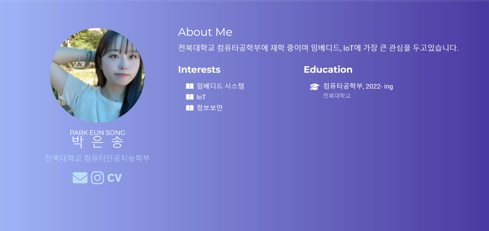

# [은송의 포트폴리오]

전북대학교 컴퓨터공학부에 재학중인 박은송의 포트폴리오입니다.

## 주메뉴
### 1. about Me

자기소개와 함께 관심사, 활용언어 등을 소개합니다

### 2.interview

기업관계자와 인터뷰했던 내용이 담겨져있습니다

### 3. intersts

취미와 관련한 관심사를 소개합니다

### 4.experience

최근 활동했던 경험들이 담겨있습니다

### 5. projects

진행했던 프로젝트들이 담겨져있습니다

### 6.cotact

연락할 수 있는 방법이 담겨져있습니다

더 많은 포트폴리오 내용은 사이트[https://eunly00.github.io/]에서 확인할 수 있습니다
